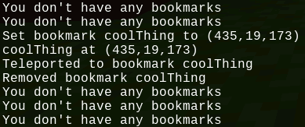

# Better Bookmarks

Minetest mod to keep location bookmarks like /sethome

## Commands:

| Command  | Parameters        | Description                                                                            |
| -------- | ----------------- | -------------------------------------------------------------------------------------- |
| `/bm`    | `<bookmark-name>` | Show waypoint for bookmark. "-" is where you were when you last successfully ran `/bm` |
| `/bmset` | `<bookmark-name>` | Set a bookmark to your current position. Bookmark names may not contain "."            |
| `/bmdel` | `<bookmark-name>` | Delete a bookmark                                                                      |
| `/bmls`  |                   | List all your bookmarks                                                                |

## Privileges

| Privilege                   | Description                                                                              |
| --------------------------- | ---------------------------------------------------------------------------------------- |
| `better_bookmarks_teleport` | Teleport player to bookmark instead of showing waypoint. `teleport` will also allow this |
